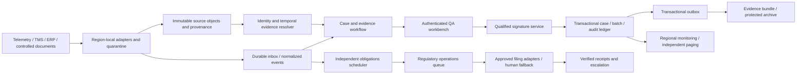

# Proposed production architecture

This is a production proposal, not the topology implemented by the local prototype. See [system architecture](../docs/02-system-architecture.md).

```mermaid
flowchart LR
    Sources[Telemetry / TMS / ERP / controlled documents] --> Adapters[Region-local adapters and quarantine]
    Adapters --> Raw[Immutable source objects and provenance]
    Adapters --> Inbox[Durable inbox / normalized events]
    Inbox --> Cases[Case and evidence workflow]
    Inbox --> Clock[Independent obligations scheduler]
    Raw --> Resolve[Identity and temporal evidence resolver]
    Resolve --> Cases
    Cases --> Review[Authenticated QA workbench]
    Review --> Sign[Qualified signature service]
    Sign --> Ledger[Transactional case / batch / audit ledger]
    Ledger --> Outbox[Transactional outbox]
    Outbox --> Export[Evidence bundle / protected archive]
    Clock --> Reg[Regulatory operations queue]
    Reg --> Delivery[Approved filing adapters / human fallback]
    Delivery --> Receipts[Verified receipts and escalation]
    Ledger --> Metrics[Regional monitoring / independent paging]
```
