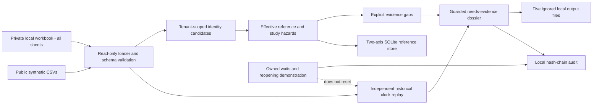

# Local data flow

```mermaid
flowchart LR
  XLSX[Private local workbook - all sheets] --> Load[Read-only loader and schema validation]
  CSV[Public synthetic CSVs] --> Load
  Load --> Resolve[Tenant-scoped identity candidates]
  Resolve --> Ref[Effective reference and study hazards]
  Ref --> Gap[Explicit evidence gaps]
  Gap --> Dossier[Guarded needs-evidence dossier]
  Load --> Clock[Independent historical clock replay]
  Clock --> Dossier
  Dossier --> Export[Five ignored local output files]
  Dossier --> Audit[Local hash-chain audit]
  Ref --> Temporal[Two-axis SQLite reference store]
  Workflow[Owned waits and reopening demonstration] --> Audit
  Workflow -. does not reset .-> Clock
```
