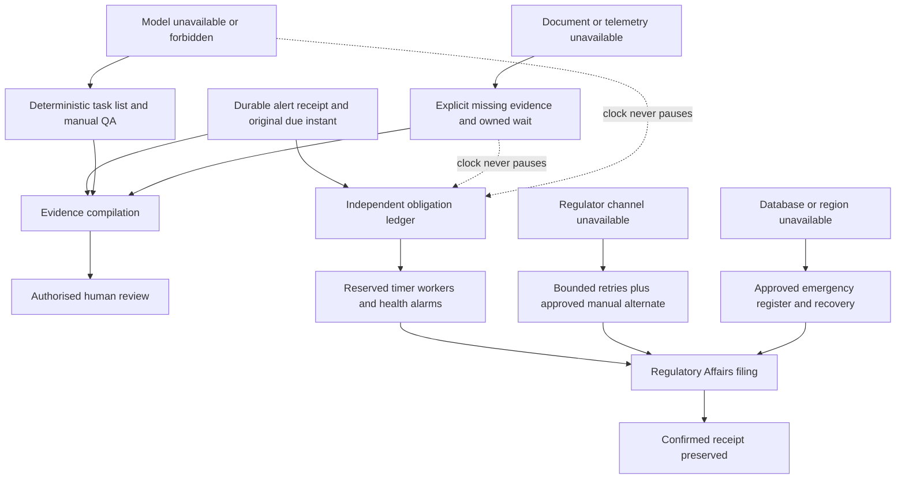

# Degradation modes

Production fallback design, not an implemented HA platform.

```mermaid
flowchart TD
  Alert[Durable alert receipt and original due instant] --> Duty[Independent obligation ledger]
  Alert --> Compile[Evidence compilation]
  Model[Model unavailable or forbidden] --> NoModel[Deterministic task list and manual QA]
  Source[Document or telemetry unavailable] --> Gap[Explicit missing evidence and owned wait]
  NoModel --> Compile
  Gap --> Compile
  Compile --> Human[Authorised human review]
  Duty --> Sweep[Reserved timer workers and health alarms]
  Sweep --> Filing[Regulatory Affairs filing]
  Reg[Regulator channel unavailable] --> Retry[Bounded retries plus approved manual alternate]
  Retry --> Filing
  Filing --> Receipt[Confirmed receipt preserved]
  DB[Database or region unavailable] --> Emergency[Approved emergency register and recovery]
  Emergency --> Filing
  Gap -. clock never pauses .-> Duty
  Model -. clock never pauses .-> Duty
```
