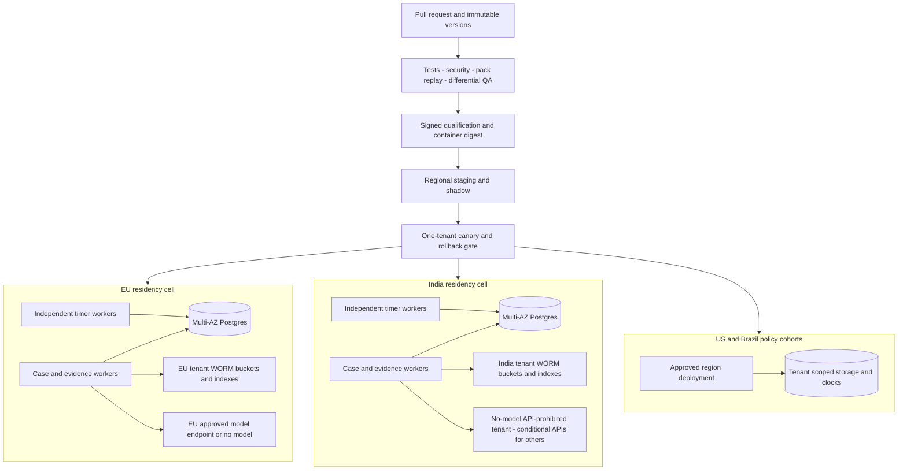

# Qualified regional promotion

Production proposal; only the local kernel and demonstration workflow are implemented.

```mermaid
flowchart TB
  PR[Pull request and immutable versions] --> CI[Tests - security - pack replay - differential QA]
  CI --> Gate[Signed qualification and container digest]
  Gate --> Stage[Regional staging and shadow]
  Stage --> Canary[One-tenant canary and rollback gate]
  Canary --> EU
  Canary --> IN
  Canary --> OTHER
  subgraph EU[EU residency cell]
    EAPI[Case and evidence workers] --> EDB[(Multi-AZ Postgres)]
    EAPI --> EW[EU tenant WORM buckets and indexes]
    EC[Independent timer workers] --> EDB
    EAPI --> EM[EU approved model endpoint or no model]
  end
  subgraph IN[India residency cell]
    IAPI[Case and evidence workers] --> IDB[(Multi-AZ Postgres)]
    IAPI --> IW[India tenant WORM buckets and indexes]
    IC[Independent timer workers] --> IDB
    IAPI --> IM[No-model API-prohibited tenant - conditional APIs for others]
  end
  subgraph OTHER[US and Brazil policy cohorts]
    OAPI[Approved region deployment] --> ODB[(Tenant scoped storage and clocks)]
  end
```
